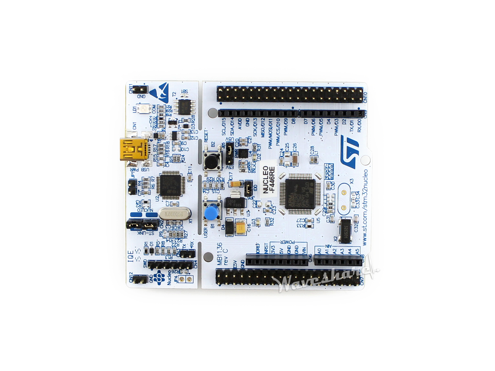

Spending my 9 to 5 working in big tech, developing AI applications and Python scripts, I am constantly impressed by the power of Claude Code and Codex in building out entire features, testing code, and finding sneaky bugs. It feels like we are nearing the end-game for these models becoming full SWEs. My 5 to 9, however, paints a very different picture.

Those of us familiar with embedded systems, or *firmware,* will know the struggles AI models in those environments. These models often fail to implement the basic communication protocols, meet timing/space constraints, work with fixed point arithmetic, or debug outgoing signals. The situation gets even worse when dealing with niche processors or confusing spec sheets.

What gives? Let's take a look at some examples.

## Strobing: the "hello world" of the wire

When embedded engineers pick up a new chip, one of the first things they might do is send a "strobe" down a port to make sure things are working as expected. In this first example, we pick up an STM32 NUCLEO-F446RE evaluation kit. It's perhaps the most popular microprocessor (MCU) out there, due largely to it's price. It looks like this:



That black square in the middle is the CPU, and the black bars on the top and bottom are I/O ports through which this thing communicates with the outside world.

We open Claude Code with Opus 4.7 in a sandboxed Docker container and assign it this simple task:

````text
# GPIO strobe

Drive **PA5** on the STM32 Nucleo-F446RE as a square-wave strobe:

- **5** full cycles. Each cycle is one HIGH pulse followed by one LOW (return to the idle level).
- **Period:** 200000 µs per cycle (rising edge to next rising edge).
- **Idle level:** LOW before the first pulse and after the last pulse.
- **Duty cycle:** approximately 50% (HIGH for half the period, then LOW for half the period).
- Language: C.

Use CMSIS for proper header definitions for ports, which you can find in /opt/stm32

Before finishing, remove intermediate artifacts from local testing (binaries, log files, capture output). Keep source files, build.sh, and linker scripts your build depends on.

## Build
Produce a build.sh that cross-compiles your C source with arm-none-eabi-gcc for the STM32F446RE (Cortex-M4F), e.g. `arm-none-eabi-gcc -mcpu=cortex-m4 -mthumb -mfpu=fpv4-sp-d16 -mfloat-abi=hard -O2 -T stm32f446re.ld <src> -o main.elf`.
````

A few things of note:

- The agent is given some basic libraries (CMSIS) which aren't strictly necessary but can be a nice help.
- The agent has access to the compiler to verify that things at least build.
- The compiler command is provided. This just focuses the attention on the actual code for now. In the future we can give the agent more freedom. Maybe the agent wants to use different optimization flags for example.

That pin on the STM chip is wired up to a separate monitoring device which will be reading the signal being sent out of that port. This device outputs it's readings to our host machine, where we are free to analyze it on our own time.

Let's see what kind of signals this exact setup gets us on 3 separate invocations of the agent.


Immediately we see some inconsistency. It seems that trajectories 2 and 3 have a very accurate period (rising edge to rising edge) of 200ms. Trajectory 1, however, has a consistent but incorrect period of 450ms. What happened?

The code structures of all three rollouts look very similar. Here is the relevant snippet from trajectory 2:

```c
/* HSI = 16 MHz after reset; SysTick clocked from HCLK (CLKSOURCE = 1). */
static void delay_us(uint32_t us)
{
    while (us > 0U) {
        uint32_t chunk = (us > 1000000U) ? 1000000U : us;
        SysTick->LOAD = (16U * chunk) - 1U;
        SysTick->VAL  = 0U;
        SysTick->CTRL = SysTick_CTRL_CLKSOURCE_Msk | SysTick_CTRL_ENABLE_Msk;
        while ((SysTick->CTRL & SysTick_CTRL_COUNTFLAG_Msk) == 0U) { }
        SysTick->CTRL = 0U;
        us -= chunk;
    }
}

int main(void)
{
    RCC->AHB1ENR |= RCC_AHB1ENR_GPIOAEN;
    (void)RCC->AHB1ENR;

    /* PA5 as general-purpose output (MODER5 = 01), push-pull, low speed, no pull. */
    GPIOA->MODER   = (GPIOA->MODER   & ~GPIO_MODER_MODER5_Msk)   | GPIO_MODER_MODER5_0;
    GPIOA->OTYPER  = (GPIOA->OTYPER  & ~GPIO_OTYPER_OT5);
    GPIOA->OSPEEDR = (GPIOA->OSPEEDR & ~GPIO_OSPEEDER_OSPEEDR5);
    GPIOA->PUPDR   = (GPIOA->PUPDR   & ~GPIO_PUPDR_PUPDR5);

    /* Ensure idle LOW before the first pulse. */
    GPIOA->BSRR = GPIO_BSRR_BR5;

    for (int i = 0; i < 5; i++) {
        GPIOA->BSRR = GPIO_BSRR_BS5;   /* HIGH */
        delay_us(100000U);             /* 100 ms */
        GPIOA->BSRR = GPIO_BSRR_BR5;   /* LOW */
        delay_us(100000U);             /* 100 ms */
    }

    for (;;) { }
}
```

Ignoring the crazy macros and bit-manipulation we know and love in low-level code, the salient thing is just the for loop with delays:

```c
    for (int i = 0; i < 5; i++) {
        GPIOA->BSRR = GPIO_BSRR_BS5;   /* HIGH */
        delay_us(100000U);             /* 100 ms */
        GPIOA->BSRR = GPIO_BSRR_BR5;   /* LOW */
        delay_us(100000U);             /* 100 ms */
    }
```

We set the port HIGH, we wait 100ms, we set it low, we wait 100ms. That's it. This trajectory's implementation of `delay_us` is based on `SysTick`. This is your classic "busy waiting" delay implementation. We just keep checking the clock until it hits the time we want.

So what went wrong in trajectory 1? It has the same exact for loop:

```c
    for (int i = 0; i < 5; i++) {
        GPIOA->BSRR = GPIO_BSRR_BS5;         /* HIGH */
        delay_us(100000U);
        GPIOA->BSRR = GPIO_BSRR_BR5;         /* LOW */
        delay_us(100000U);
    }
```

The difference came to a detail in the implementation of `delay_us`.

```c
/* Busy-wait delay calibrated for the default HSI clock (16 MHz) after reset.
 * Each loop iteration is ~4 cycles, so ~4 iterations per microsecond. */
static void delay_us(unsigned int us)
{
    volatile unsigned int n = us * 4U;
    while (n--) {
        __asm__ volatile ("nop");
    }
}
```

Although it's another busy wait implementation, this one does not use the reliable system clock. This one takes a gamble that the decrement operation `n--` takes exactly 4 system clocks to complete. Opus must have imagined that this would compile to these 4 instructions, the classic tight-loop pattern:

```nasm
delay_loop:
    nop                 @ 1 cycle
    subs  r0, r0, #1    @ 1 cycle   (decrement + set flags)
    bne   delay_loop    @ 2 cycles  (taken branch: 1 + 1-cycle pipeline reload)
```

The mistake was forgetting that declaring the counter `volatile` *forbids* the compiler from keeping it in `r0` and forces an `ldr`/`str` pair around every decrement, which is what actually got emitted when we disassemble the binary that was produced:

```nasm
.Lloop:
    nop                 @ 1 cycle
    ldr   r3, [sp, #4]  @ 2 cycles   (volatile load — can't be elided)
    subs  r2, r3, #1    @ 1 cycle
    str   r2, [sp, #4]  @ 2 cycles   (volatile store — can't be elided)
    cmp   r3, #0        @ 1 cycle
    bne   .Lloop        @ 2 cycles
```

Looks like it actually takes 9 cycles per iteration, not the expected 4. And if we divide 450ms by 200ms, we find that same exact ratio.

Timing is a huge part of firmware development. Maybe the agent would have caught this with some more feedback (will dive in on this in future posts), but it was a risk to implement it like this in the first place, and the model clearly forgot the rules around `volatile` variables.
