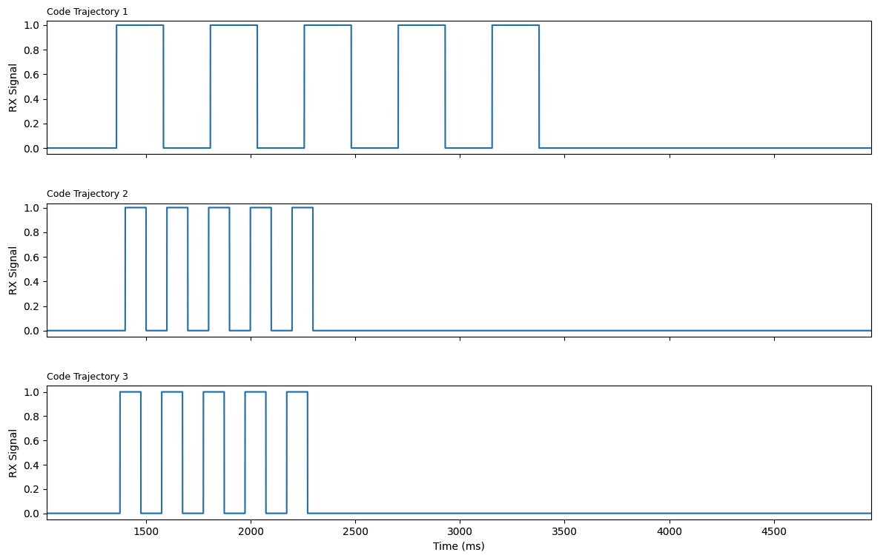
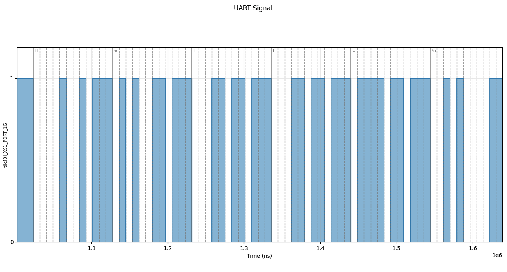
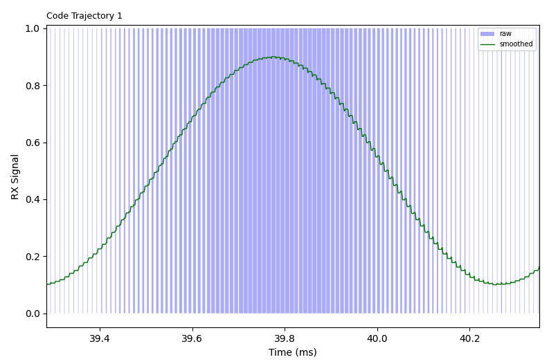
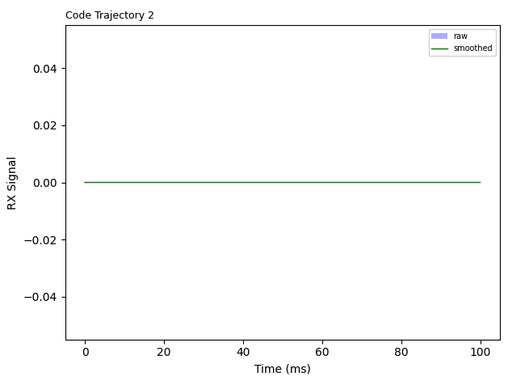

In this post we will dive in on some concrete examples of a modern coding agent working with *firmware*, or embedded systems.

Firmware is a fuzzy term, but we use it to mean low-level programs that usually run without an OS, dealing directly with electrical signals or running on small embedded systems.

In these examples, we begin to illustrate how coding agents are often messing up on basic and routine tasks that firmware engineers encounter. We believe that this is a real weakness in these models, especially compared to how good they have gotten with the more typical web and application development work.

## The Hardware Environment

Today we are asking coding agents to write firmware for the STM32 NUCLEO-F446RE microcontroller (MCU). The STM family is perhaps the most popular choice out there. They are accessible, affordable, and used in a surprising amount of commercial products and smaller projects. This board also comes with general-purpose I/O ports (GPIOs) which the core can send and read electrical signals through.

To monitor what the STM (the *device-under-test* or *DUT*) is emitting, and to send signals into the STM, we hook up wires from these ports to our *proctor device*. For now this is a more specialized MCU called an XMOS. Depending on the task, data might be flowing from the DUT to the proctor, or from the proctor to the DUT.

Both the DUT and the proctor are configured and programmed by the host server. This is just your more typical computer. It can flash (deploy) code to the DUT, configure the proctor, and get observation signals back. That's the whole setup for now.


When a task is executed, the environment/proctor gets set up before the trajectory code is flashed. After some execution time (usually a few seconds), we end the experiment and collect our results:

- Compilation / build / flash output
- STDIO from the STM target to the host machine
- Signal readings on the wires we are testing (using that monitoring device)
- STDIO from the monitoring device

We will be looking at these when analyzing what is going on.

## Strobing: The "Hello World" of the Wire

When embedded engineers pick up a new chip, one of the first things they might do is send a "strobe" down a port to make sure things are working as expected. This literally means toggling the value at a pin up and down (high and low). This checks that we are able to flash code onto the chip, that the chip can actually control the potential at the ports, and that our timing works as expected.

We open Claude Code with Opus 4.7 in a sandboxed Docker container and assign it this simple task:

````text
# GPIO strobe

Drive **PA5** on the STM32 Nucleo-F446RE as a square-wave strobe:

- **5** full cycles. Each cycle is one HIGH pulse followed by one LOW (return to the idle level).
- **Period:** 200000 µs per cycle (rising edge to next rising edge).
- **Idle level:** LOW before the first pulse and after the last pulse.
- **Duty cycle:** approximately 50% (HIGH for half the period, then LOW for half the period).
- Language: C.

Use CMSIS for proper header definitions for ports, which you can find in /opt/stm32

Before finishing, remove intermediate artifacts from local testing (binaries, log files, capture output). Keep source files, build.sh, and linker scripts your build depends on.

## Build
Produce a build.sh that cross-compiles your C source with arm-none-eabi-gcc for the STM32F446RE (Cortex-M4F), e.g. `arm-none-eabi-gcc -mcpu=cortex-m4 -mthumb -mfpu=fpv4-sp-d16 -mfloat-abi=hard -O2 -T stm32f446re.ld <src> -o main.elf`.
````

A few things of note:

- The agent is given some basic libraries (CMSIS) which aren't strictly necessary but can be a nice help.
- The agent has access to the compiler to verify that things at least build.
- The compiler command is provided. This just focuses the attention on the actual code for now. In the future we can give the agent more freedom. Maybe the agent wants to use different optimization flags for example.

Let's see what kind of signals this exact setup gets us on 3 separate invocations of the agent.



Immediately we see some inconsistency. It seems that trajectories 2 and 3 have a very accurate period (rising edge to rising edge) of 200ms. Trajectory 1, however, has a consistent but incorrect period of 450ms. What happened?

The code structures of all three rollouts look very similar. Here is the relevant snippet from trajectory 2:

```c
/* HSI = 16 MHz after reset; SysTick clocked from HCLK (CLKSOURCE = 1). */
static void delay_us(uint32_t us)
{
    while (us > 0U) {
        uint32_t chunk = (us > 1000000U) ? 1000000U : us;
        SysTick->LOAD = (16U * chunk) - 1U;
        SysTick->VAL  = 0U;
        SysTick->CTRL = SysTick_CTRL_CLKSOURCE_Msk | SysTick_CTRL_ENABLE_Msk;
        while ((SysTick->CTRL & SysTick_CTRL_COUNTFLAG_Msk) == 0U) { }
        SysTick->CTRL = 0U;
        us -= chunk;
    }
}

int main(void)
{
    RCC->AHB1ENR |= RCC_AHB1ENR_GPIOAEN;
    (void)RCC->AHB1ENR;

    /* PA5 as general-purpose output (MODER5 = 01), push-pull, low speed, no pull. */
    GPIOA->MODER   = (GPIOA->MODER   & ~GPIO_MODER_MODER5_Msk)   | GPIO_MODER_MODER5_0;
    GPIOA->OTYPER  = (GPIOA->OTYPER  & ~GPIO_OTYPER_OT5);
    GPIOA->OSPEEDR = (GPIOA->OSPEEDR & ~GPIO_OSPEEDER_OSPEEDR5);
    GPIOA->PUPDR   = (GPIOA->PUPDR   & ~GPIO_PUPDR_PUPDR5);

    /* Ensure idle LOW before the first pulse. */
    GPIOA->BSRR = GPIO_BSRR_BR5;

    for (int i = 0; i < 5; i++) {
        GPIOA->BSRR = GPIO_BSRR_BS5;   /* HIGH */
        delay_us(100000U);             /* 100 ms */
        GPIOA->BSRR = GPIO_BSRR_BR5;   /* LOW */
        delay_us(100000U);             /* 100 ms */
    }

    for (;;) { }
}
```

Ignoring the crazy macros and bit-manipulation we know and love in low-level code, the salient thing is just the for loop with delays:

```c
    for (int i = 0; i < 5; i++) {
        GPIOA->BSRR = GPIO_BSRR_BS5;   /* HIGH */
        delay_us(100000U);             /* 100 ms */
        GPIOA->BSRR = GPIO_BSRR_BR5;   /* LOW */
        delay_us(100000U);             /* 100 ms */
    }
```

We set the port HIGH, we wait 100ms, we set it low, we wait 100ms. That's it. This trajectory's implementation of `delay_us` is based on `SysTick`. This is your classic "busy waiting" delay implementation. We just keep checking the clock until it hits the time we want.

So what went wrong in trajectory 1? It has the same exact for loop:

```c
    for (int i = 0; i < 5; i++) {
        GPIOA->BSRR = GPIO_BSRR_BS5;         /* HIGH */
        delay_us(100000U);
        GPIOA->BSRR = GPIO_BSRR_BR5;         /* LOW */
        delay_us(100000U);
    }
```

The difference came to a detail in the implementation of `delay_us`.

```c
/* Busy-wait delay calibrated for the default HSI clock (16 MHz) after reset.
 * Each loop iteration is ~4 cycles, so ~4 iterations per microsecond. */
static void delay_us(unsigned int us)
{
    volatile unsigned int n = us * 4U;
    while (n--) {
        __asm__ volatile ("nop");
    }
}
```

Although it's another busy wait implementation, this one does not use the reliable system clock. This one takes a gamble that the decrement operation `n--` takes exactly 4 system clocks to complete. Opus may have imagined that this would compile to these 4 instructions, the classic tight-loop pattern:

```nasm
delay_loop:
    nop                 @ 1 cycle
    subs  r0, r0, #1    @ 1 cycle   (decrement + set flags)
    bne   delay_loop    @ 2 cycles  (taken branch: 1 + 1-cycle pipeline reload)
```

The mistake was forgetting that declaring the counter `volatile` *forbids* the compiler from keeping it in `r0` and forces an `ldr`/`str` pair around every decrement, which is what actually got emitted when we disassemble the binary that was produced:

```nasm
.Lloop:
    nop                 @ 1 cycle
    ldr   r3, [sp, #4]  @ 2 cycles   (volatile load — can't be elided)
    subs  r2, r3, #1    @ 1 cycle
    str   r2, [sp, #4]  @ 2 cycles   (volatile store — can't be elided)
    cmp   r3, #0        @ 1 cycle
    bne   .Lloop        @ 2 cycles
```

Looks like it actually takes 9 cycles per iteration, not the expected 4. And if we divide 450ms by 200ms, we find that same exact ratio.

Timing is a huge part of firmware development. Maybe the agent would have caught this with some more feedback (will dive in on this in future posts), but it was a risk to implement it like this in the first place, and the model clearly forgot the rules around `volatile` variables.

**Takeaway:** The coding agent mis-understood the amount of instructions it takes to iterate that while loop, which it relied on for a time measurement. This caused an incorrect strobe frequency being sent down the wire.

## UART: Transmitting Data on One Wire

Now lets talk about a basic real-world task, which is to transmit some data. The data could be some numbers, a string, or anything else. The basic solution is the UART protocol. UART works by the two devices first agreeing on a "baud rate", which is simply the frequency at which we expect the potential on the wire to change. Higher rates mean faster data transfer, but if you go too fast you might encounter stability issues. Then, the protocol is to send over one byte at a time. This only requires one wire.

The reason UART can work without any clock edge is that the sender and receiver agree on a simple protocol:

- The wire by default stays HIGH (idle state).
- When a byte of data needs to be sent, the sender first pulls the wire low for one bit. This is called the start bit.
- After the start bit, 8 bits of data are transmitted.
- At the end there is an optional stop bit.

In this task, we are going to flip the script a little. Instead of our agent writing the sender, this time the environment will pass the signal into our target platform, and the agent is tasked with writing the reader code. It will simply have to read the incoming data and print it out to the host server (which by the way, also happens over UART).

At a baud rate of 115,200, this is the kind of signal we get on the wire when we send the string "Hello" across:



We've added some gray dotted lines to space out the bits and some gray full lines for each byte sent over. In ASCII, "Hello" with the new line at the end is represented with these 8-bit integers:

| **Character** | **ASCII 8-bit integer** |
| --- | --- |
| H | 72 |
| e | 101 |
| l | 108 |
| l | 108 |
| o | 111 |
| \n | 10 |

You can verify that each byte is sent over in LSB (least significant bit first). Keep this in mind if doing the exercise:

- Each byte starts with that 0 start bit
- After 8 actual data bytes, we end with a few 1's. This is just for visual padding. Technically it slows down the transmission rate, but it's legal under UART standard. In fact, you can wait as long as you want between transmitting bytes, so long as you keep that idle line high.

Okay so now with the environment set up, it's time to see if a coding agent can correctly write the code for a receiver to catch the data coming down the wire. That same code will also have to parse those values and send them to the host server for us to see. Here is the task:

````text
# UART receiver

The goal of this task is to receive a sequence of bytes over UART on a STM32 Nucleo-F446RE and echo each byte back over STDIO.

## Specifics
- RX pin: PA5
- Baud rate: 115200
- 8 data bits, 1 stop bit, no parity, LSB first
- Language: C

For **each byte received**, immediately `printf` its decimal value followed by a newline character to STDIO.

Feel free to use CMSIS for proper header definitions for ports, which you can find in /opt/stm32

Before finishing, remove intermediate artifacts from local testing (binaries, log files, capture output). Keep source files, build.sh, and linker scripts your build depends on.

## Build
Produce a build.sh that cross-compiles your C source with arm-none-eabi-gcc for the STM32F446RE (Cortex-M4F), e.g. `arm-none-eabi-gcc -mcpu=cortex-m4 -mthumb -mfpu=fpv4-sp-d16 -mfloat-abi=hard -O2 -T stm32f446re.ld <src> -o main.elf`.
````

You might be wondering about this line:

```c
For **each byte received**, immediately `printf` its decimal value followed by a newline character to STDIO.
```

This line forces the agent to convert the raw byte to the decimal string. The reason for this is to avoid the agent simply creating a "passthrough" between the incoming wire and the wire going to the host computer, which offloads the burden of UART interpretation to the host. This way we force the STM code to actually perform the parsing itself. This means we expect to see the numbers from that ASCII table above in that order.

So, when we run the trajectory code, what do we actually get?

```text
164 # should be 72 (H)
178 # should be 101 (e)
182 # should be 108 (l)
182 # should be 108 (l)
183 # should be 111 (o)
133 # should be 10 (\n)
```

Something is very off. When firmware engineers see something like this, the first instinct might be to actually look at the binary values of these integers.

| **char** | **real** | **real binary (LSB)** | **got** | **got binary (LSB)** |
| --- | --- | --- | --- | --- |
| H | 72 | 00010010 | 164 | 00100101 |
| e | 101 | 10100110 | 178 | 01001101 |
| l | 108 | 00110110 | 182 | 01101101 |
| l | 108 | 00110110 | 182 | 01101101 |
| o | 111 | 11110110 | 183 | 11101101 |
| \n | 10 | 01010000 | 133 | 10100001 |

If you stare at this long enough you'll see a pattern. It seems that the bit strings are just shifted left and padded with 1's on the right, which simply means we are sampling too late. Something in the code is causing a lag between detecting a start bit and sampling that first data bit. We start sampling on the second.

At this point something really cool and illustrative happened. We informed the coding agent of this issue, continuing it's session from before. The coding agent reasoned for a while and began trying to simulate the issue using an idealized model run in Python. We were surprised by this effort, and then really interested when the simulation claimed that this should have worked.

> **Note:** *As an aside—we are often asked about why we are choosing the hardware-first approach instead of simulators. We know from experience that simulations do not always play out as expected when the rubber hits the road. Admittedly, Python might not be the best way to simulate this, but in later posts we will demonstrate our case more clearly.*

So anyway, what went wrong in the trajectory? If we look at the trajectory code, the agent decided to solve this problem by **defining interrupt handlers for conditions on the input pin**. This is a cool feature of a lot of MCU platforms that let them manage thing in parallel (without just having core spin on a port). Concretely, it armed a falling-edge interrupt for "a frame is starting," and a timer interrupt for "sample the next bit":

```c
    /* EXTI5 falling-edge trigger (start bit). */
    EXTI->IMR  |=  (1u << RX_PIN);
    EXTI->FTSR |=  (1u << RX_PIN);
    ...
    NVIC_SetPriority(EXTI9_5_IRQn, 1);
    NVIC_EnableIRQ(EXTI9_5_IRQn);
```

When that edge fires, the handler establishes the timing reference for the whole byte—it zeroes the timer and schedules the first sample 1.5 bit periods later (one bit to step over the start bit, half a bit to land in the *center* of data bit 0). This is done by setting values that another handler will respond on.

```c
void EXTI9_5_IRQHandler(void) {
    if ((EXTI->PR & (1u << RX_PIN)) != 0u) {
        EXTI->PR = (1u << RX_PIN);                  /* clear pending */
        EXTI->IMR &= ~(1u << RX_PIN);               /* mask until byte done */
        ...
        TIM2->CNT = 0u;
        TIM2->ARR = FIRST_SAMPLE_ARR;
        ...
        TIM2->CR1 |= TIM_CR1_CEN;
    }
}
```

IRQ means *Interrupt Request*—this will fire when the port condition is met (when it goes low). This part arms another interrupt routine—the timer one:

```c
void TIM2_IRQHandler(void) {
    if ((TIM2->SR & TIM_SR_UIF) != 0u) {
        TIM2->SR = (uint32_t)~TIM_SR_UIF;

        if (rx_bit_idx == 0u) {
            /* After the first 1.5-bit wait, switch to 1 bit period per sample. */
            TIM2->ARR = BIT_ARR;
        }

        if (rx_bit_idx < 8u) {
            uint8_t bit = (uint8_t)((GPIOA->IDR >> RX_PIN) & 1u);
            rx_shift   |= (uint8_t)(bit << rx_bit_idx);  /* LSB first */
            rx_bit_idx++;
        } else {
            /* Centre of the stop bit: end of frame.  Hand byte to main loop
             * and re-arm start-bit detection. */
            TIM2->CR1 &= ~TIM_CR1_CEN;
            rx_value = rx_shift;
            rx_ready = 1u;
            EXTI->PR  = (1u << RX_PIN);
            EXTI->IMR |= (1u << RX_PIN);
        }
    }
}
```

This part will re-arm itself bit-by-bit for the whole byte, but when it originally fires it tries to wait for 1.5-bits (to skip the start bit). The wait is most likely successful, but it seems there is some timing issue making this an unreliable approach.

There's a ton of things to try here that might have worked better. First of all, there was no reason for the agent to use 16MHz as the clock speed for this STM. It could configure it as fast as 180MHz, which might have avoided an entire frame delay.

Secondly, for this concrete task we could have just busy-waited on the port, oversampling and reading every bit in with a state machine. The model got a bit too creative, but perhaps it was imagining this would expand into something else.

We will get into "golden solutions" more in later posts, as the discussion here would take pages and pages. For now, it suffices to say that this UART reading is incorrect.

**Takeaway:** The agent's code read the signal one bit too late, corrupting the data stream. We spent multiple sessions pushing Opus 4.7 to find the issue, and it couldn't.

## PWM: Hacking an Analog Output

Many platforms don't have a way to drive a pin to anything other than high/low. If you need to produce an analog signal, you are forced to add a DAC (digital-to-analog converter, we will come back to these in the next blog). However, if you are willing to approximate, you can hack one from the 0's and 1's.

Imagine a light bulb that is turned on and off very fast. If you flick it fast enough, the light will just seem like a consistent dim light. The amount of time this light spends on vs off controls the brightness. This is control of "on time" and "off time" inside a "duty cycle" is called Pulse Width Modulation (PWM).

Let's see how well Claude Opus 4.7 implements this protocol on our STM Chip. Here is the task:

````text
# PWM sine wave

Drive **PA5** on the STM32 Nucleo-F446RE with a PWM signal whose duty cycle is modulated by a sine wave. After a simple lowpass filter, the output should look like a tone at **1000 Hz**.

## Signal definition

- Sine frequency: **1000 Hz**
- Duty cycle sweeps between **0.1** and **0.9** (fractional, where 0.0 = always LOW, 1.0 = always HIGH).
- Run for at least **2.0 seconds** of continuous output, then idle LOW.
- Idle level: LOW before the first PWM cycle and after the last.
- Language: C.

Use CMSIS for proper header definitions for ports, which you can find in /opt/stm32.

Before finishing, remove intermediate artifacts from local testing (binaries, log files, capture output). Keep source files, build.sh, and linker scripts your build depends on.

## Build
Produce a build.sh that cross-compiles your C source with arm-none-eabi-gcc for the STM32F446RE (Cortex-M4F), e.g. `arm-none-eabi-gcc -mcpu=cortex-m4 -mthumb -mfpu=fpv4-sp-d16 -mfloat-abi=hard -O2 -T stm32f446re.ld <src> -o main.elf`.
````

We run this a few times and get some interesting approaches. My favorite was the trajectory that used Python to pre-compute a table of trig values, to avoid expensive floating point operations. When we run that golden code, we get a good looking signal. Below we have the actual signal plotted in blue and the smoothed version in green. Remember that at these high frequencies, the smoothed signal resembles more what you will actually experience in your eyes/ears.



As expected, the more dense raw blue signal corresponds to higher smoothed values, less density to lower ones. This is a great trajectory!

Not all of them succeed though. In one particular example, we just get a flat line.



The issue here is very involved. It's almost hard to be upset at the model. This salient part of the trajectory is really just this:

```c
int main(void) {
    enable_fpu();
    ...
    build_duty_table();
		...
}
```

This might look totally normal. For starters, this attempt chose to use the FPU (floating point unit), a dedicated piece of hardware for doing floating point arithmetic. The `build_duty_table()` call will use that FPU to populate the duty table. Those operations will use specific floating point registers, which should be enabled by the time we finish calling `enable_fpu()`.

The trick is that we actually access those floating point registers before we even call `enable_fpu()`. From the ARM Architecture Procedure Call Standard, we have this rule:

> *Subroutines that modify any of `d8..d15` (`s16..s31`) must preserve those registers across the call.*

Some of these registers correspond to the FPU-specific registers, so we are forced to preserve them, which means writing them to the stack at the beginning of the `main` function. You can see the disassembly right here:

```c
080000d4 <main>:
 ...
 80000e0: vpush  {d8-d10}                ; main's prologue
 ...
 80000f6: vldr   s19, [pc, ...]          ; PWM_FREQ_HZ = 200000.0f
 80000fa: vldr   s18, [pc, ...]          ; 2*pi*1000   (in d9)
 80000fe: vldr   s17, [pc, ...]          ; 0.4f        (duty_amp, in d8)
 8000102: vldr   s20, [pc, ...]          ; 80.0f       (PWM_TICKS, in d10)
 ...
```

Turns out, we can't actually do `vpush` on those registers before we `enable_fpu()`, because technically those registers aren't enabled yet.

The trick here is to do this enabling in the `Reset_Handler`, which actually runs before the `main` function and doesn't need those floating point registers.

**Takeaway:** The agent overlooked a nuance in how we use FPU registers. It inadvertently accessed them before we enabled access to them, causing a crash.

## What Next?

We are excited about what we saw even on these basic introductory cases. It seems that the agents can get confused about timing, about the low-level assembly logic, and even mistakenly believe in an idealized simulation in that UART task. These are the basic primitives that need to be nailed to write successful firmware in production.

This blog was meant to be the bare intro, aiming to get AI researchers and engineers interested in these problems. In the coming blogs, we are going to look at more MCUs and FPGAs, we are going to look at interactions with common peripheral devices, and we are going to complicate the tasks further so that they start looking like real production situations. Stay tuned, we are aiming to post every week.

From our ongoing interviews with professionals working in robotics, radio, audio, manufacturing, and other firmware-related industries, we are building a sense that there is a lot of room to grow. These engineers are currently lacking trust in these agents, and we think that the right training environment could turn this around.

*P.S. We don't mean to pick on Claude in this blog. We wanted to choose a very strong model to make the best case for us. In the following blogs we will start looking at more models and agent harnesses.*
